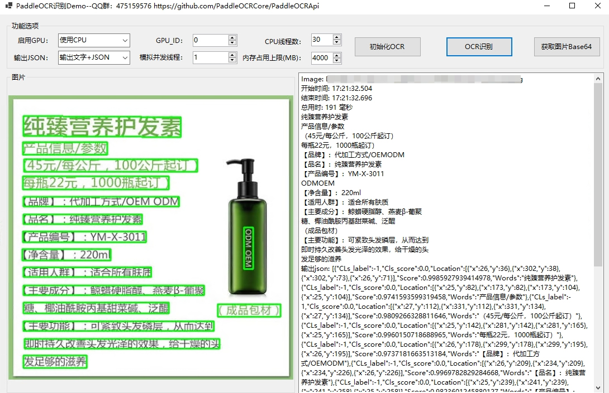

### 离线OCR组件 支持.net/C++/java/Python/Go语言开发
## 项目介绍
免费离线OCR组件,支持CPU/GPU，免费使用，免费升级，支持.net/C++/java/Python/Go语言开发，支持多线程并发，支持内存自动回收， 基于百度飞桨PaddleOCR封装的C++动态链接库，可用于.net/C++/java/Python/Go等语言中调用，支持paddle_inference2.6.2及3.0推理库。
喜欢的请给本项目点一个免费的Star

## 运行环境
项目运行环境为VS2022+.net8.0：

1、默认[paddle_inference2.6.2](https://www.paddlepaddle.org.cn/inference/v2.6/guides/install/download_lib.html#windows)版本CPU版本推理库，其它推理库请手动下载

- paddle_inference2.6.2版本推理库下载

- CPU版本，解压后将paddle\lib目录下的common.dll和paddle_inference.dll复制到程序运行文件夹
https://paddle-inference-lib.bj.bcebos.com/2.6.2/cxx_c/Windows/CPU/x86-64_avx-mkl-vs2019/paddle_inference.zip

- GPU版本，解压后将paddle\lib目录下的common.dll和paddle_inference.dll复制到程序运行文件夹
https://paddle-inference-lib.bj.bcebos.com/2.6.2/cxx_c/Windows/GPU/x86-64_cuda12.0_cudnn8.9.1_trt8.6.1.6_mkl_avx_vs2019/paddle_inference.zip

2、进QQ群475159576，下载群文件的PaddleOCRLib.zip，解压后放到编译的根目录中

3、核心文件PaddleOCR.dll为C++动态链接库，支持CPU/GPU模式(GPU需接说明安装对应环境)

Demo预览：

依赖库列表参考：

## 调用参数说明
| 参数名称                     | 默认值 | 值说明                                                                                   |
| ---------------------------- | ------ | ---------------------------------------------------------------------------------------- |
| det_model_dir                | -      | 检测模型inference model地址                                                              |
| cls_model_dir                | -      | 方向分类器inference model地址                                                            |
| rec_infer                    | -      | 文字识别模型inference model地址                                                          |
| keys                         | -      | 文字识别字典文件                                                                         |
| table_model_dir              | -      | 表格识别模型inference model地址                                                          |
| table_char_dict_path         | -      | 表格识别字典文件                                                                         |
| 通用参数                 | --     | -- |
| det                          | true   | 是否执行文字检测                                                                         |
| rec                          | true   | 是否执行文字识别                                                                         |
| cls                          | false  | 是否执行文字方向分类                                                                     |
| use_gpu                      | false  | 是否使用GPU                                                                              |
| gpu_id                       | 0      | GPU id，使用GPU时有效                                                                    |
| gpu_mem                      | 4000   | 使用GPU时内存                                                                            |
| use_tensorrt                 | false  | 使用GPU预测时，是否启动tensorrt                                                          |
| cpu_mem                      | 4000   | CPU内存占用上限，单位MB。-1表示不限制                                                    |
| cpu_math_library_num_threads | 10     | CPU预测时的线程数，在机器核数充足的情况下，该值越大，预测速度越快                        |
| enable_mkldnn                | true   | 是否使用mkldnn库，关掉可以减少内存占用，但会降低速度                                     |
| 检测模型相关                 | --     | -- |
| max_side_len                 | 960    | 输入图像长宽大于960时，等比例缩放图像，使得图像最长边为960                               |
| det_db_thresh                | 0.3    | 用于过滤DB预测的二值化图像，设置为0.-0.3对结果影响不明显                                 |
| det_db_box_thresh            | 0.5    | DB后处理过滤box的阈值，如果检测存在漏框情况，可酌情减小                                  |
| det_db_unclip_ratio          | 1.6    | 表示文本框的紧致程度，越小则文本框更靠近文本                                             |
| use_dilation                 | false  | 是否在输出映射上使用膨胀                                                                 |
| det_db_score_mode            | true   | true:使用多边形框计算bbox score，false:使用矩形框计算。矩形框计算速度更快，多边形框对弯曲文本区域计算更准确。                                                        |
| visualize                    | false  | 是否对结果进行可视化，为false时，预测结果会保存在output文件夹下和输入图像同名的图像上。  |
|方向分类器相关                | --     | -- |
| use_angle_cls                | false  | 是否使用方向分类器                                                                       |
| cls_thresh                   | 0.9    | 方向分类器的得分阈值                                                                     |
| cls_batch_num                | 1      | 方向分类器批量识别数量                                                                   |
| 识别模型相关                 | --     | -- |
| rec_batch_num                | 6      | 文字识别模型批量识别数量                                                                 |
| rec_img_h                    | 48     | 文字识别模型输入图像高度                                                                 |
| rec_img_w                    | 320    | 文字识别模型输入图像宽度                                                                 |
| 表格识别模型相关             | --     | -- |
| table_max_len                | 488    | 表格识别模型输入图像长边大小，最终网络输入图像大小为（table_max_len，table_max_len）     |
| merge_empty_cell             | true   | 是否合并空单元格                                                                         |
| table_batch_num              | 1      | table_batch_num                                                                          |

## GPU版本环境
具体CUDA版本请参考您使用的paddle_inference版本要求

- [编译的OpenCV版本为4.7](https://github.com/opencv/opencv/releases)

当前PaddleOCR.dll用于[paddle_inference2.6.2](https://www.paddlepaddle.org.cn/inference/v2.6/guides/install/download_lib.html#windows)版本推理库，
如使用[paddle_inference3.0](https://www.paddlepaddle.org.cn/inference/master/guides/install/download_lib.html#windows)版本，请将paddleinference3目录中的PaddleOCR.dll替换当前目录文件

- paddle_inference3.0版本推理库下载

- CPU版本，解压后将paddle\lib目录下的common.dll和paddle_inference.dll复制到程序运行目录
https://paddle-inference-lib.bj.bcebos.com/3.0.0-rc0/cxx_c/Windows/CPU/x86-64_avx-mkl-vs2019/paddle_inference.zip

- GPU版本，解压后将paddle\lib目录下的common.dll和paddle_inference.dll复制到程序运行目录
https://paddle-inference-lib.bj.bcebos.com/3.0.0-beta2/cxx_c/Windows/GPU/x86-64_cuda12.3_cudnn9.0.0_trt8.6.1.6_mkl_avx_vs2019/paddle_inference.zip

- [cuda下载](https://developer.nvidia.com/cuda-12-0-0-download-archive)

- [cudnn下载](https://developer.nvidia.cn/rdp/cudnn-archive)

- [TensorRT下载](https://developer.nvidia.com/nvidia-tensorrt-download)

- [OCR识别官方模型库下载](https://gitee.com/paddlepaddle/PaddleOCR/blob/release/2.7/doc/doc_ch/models_list.md)

## 开发交流群

欢迎加入QQ群475159576交流,或者添加QQ：2380243976,若您喜欢本项目，请点击免费的star

## 捐助

如果这个项目对您有所帮助，请扫下方二维码打赏一杯咖啡。

## 更新日志
#### v1.0.2 `2025.3.23`
- 优化paddleocr.dll，增加多线程队列支持，增加内存达到上限自动回收
- WinFormDemo功能强化，增加初始化选项，增加多图选择及模拟并发测试
#### v1.0.1 `2025.3.5`
- 优化paddleocr.dll，提高识别速度
#### v1.0 `2025.1.22`
- 初版发行: PaddleOCRApi
