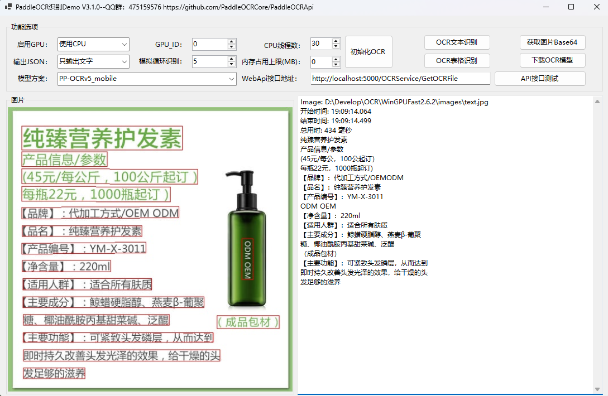

[](README.md) [](README_EN.md)
# PaddleOCRApi离线OCR组件，支持C#/C++/java/Python/Go语言开发

<p align="center">    
    <a href="./LICENSE"></a>
    <a href="https://github.com/PaddleOCRCore/PaddleOCRApi/releases"></a>
    <a href="https://github.com/PaddleOCRCore/PaddleOCRApi/stargazers"></a>
</p>

## 📖 目录

- [简介](#-简介)
- [项目特性](#-项目特性)
- [项目结构](#-项目结构)
- [快速开始](#-快速开始)
- [运行环境](#-运行环境)
- [调用参数说明](#-调用参数说明)
- [GPU环境配置](#-gpu环境配置)
- [开发交流](#开发交流群)
- [更新日志]([更新日志](./docs/CHANGELOG.md))
- [常见问题]([常见问题](./docs/FAQ.md))

## 🚀 简介

基于PaddleOCR深度封装的完全离线文字识别组件，提供简洁易用的API接口，支持CPU/GPU，支持C#/C++/Java/Python/Go等多种开发语言。完全免费使用，免费升级，支持多线程并发，支持内存自动回收，支持最新paddle_inference3.3.0推理库。

**喜欢的请给本项目点一个免费的Star ⭐**

支持最新PP-OCRv5_mobile/PP-OCRv5_server模型，向下兼容V4模型及自训练模型

> 💡 **说明**：开源版本为Windows CPU-飞浆推理库版，GPU版本依赖库进群 **475159576** 下载，更多高性能推理等更多版本请联系作者定制：QQ:**2380243976**

## 📁 相关文档
- 核心C++动态链接库PaddleOCR.dll接口文档： [PaddleOCR.dll接口清单.md](docs/PaddleOCR.dll接口清单.md)
- OCRCoreService WebAPI接口文档：[WebApi接口文档](./OCRCoreService/README.md)

## ✨ 项目特性

- ✅ **多语言支持**: C#、C++、Java、Python、Go
- ✅ **高性能**: 支持CPU/GPU推理
- ✅ **易集成**: 提供WebAPI服务，支持在线调用
- ✅ **多线程**: 支持多线程并发，内存自动回收
- ✅ **离线运行**: 无需联网，数据安全可靠
- ✅ **模型丰富**: 支持PP-OCRv5/v4/v3全系列模型
- ✅ **功能全面**: 文字检测、识别、方向分类、表格识别
- ✅ **图像矫正**: 文本图像几何变换，纠正文档扭曲、倾斜、透视变形，提升识别准确率
- ✅ **以图找图**: 在大图中找到小图输出小图位置坐标，支持登录验证滑块识别

## 📁 项目结构

```
PaddleOCRWebApi/
├── PaddleOCRSDK/                  # OCR核心SDK项目
│   ├── PaddleOCR/                  # OCR服务实现
│   │   ├── IOCRService.cs         # OCR服务接口
│   │   ├── OCRService.cs         # OCR识别服务
│   │   └── OCRSDK.cs             # SDK核心封装
│   ├── UVDoc/                    # 文本图像矫正模块
│   │   └── ...                   # 文档几何变换、透视矫正等功能
│   ├── Models/                   # 数据模型
│   └── PaddleOCRSDK.csproj      # SDK项目文件
│
├── OCRCoreService/               # WebAPI服务项目
│   ├── Controllers/              # API控制器
│   │   ├── OCRServiceController.cs   # OCR接口
│   │   ├── UVDocServiceController.cs # 文本图像矫正接口
│   │   └── HomeController.cs         # 首页
│   ├── Services/                 # 业务服务
│   │   └── OCREngine.cs         # OCR引擎
│   ├── Authorization/            # 权限验证
│   ├── Extensions/               # 扩展方法
│   ├── Utilities/                # 工具类
│   ├── Views/                    # 视图文件
│   ├── wwwroot/                  # 静态资源
│   ├── appsettings.json         # 配置文件
│   └── README.md                # WebAPI文档
│
├── Demo/                         # 多语言示例代码
│   ├── CPP/                     # C++调用示例
│   │   ├── PaddleOCRCpp.cpp    # C++示例代码
│   │   └── PaddleOCR.h         # C++头文件
│   ├── Python/                  # Python调用示例
│   │   ├── OCRPythonDemo.py    # Python示例
│   │   └── OCRTablePythonDemo.py # 表格识别示例
│   ├── GoDemo/                  # Go调用示例
│   │   └── OCRGoDemo.go        # Go示例代码
│   ├── PaddleVisionWinForm/    # 文本图像矫正WinForms示例
│   │   ├── MainForm.cs         # 主窗体
│   │   └── ...                 # 文档扭曲矫正、透视变换演示
│   └── WinFormsApp/            # OCR识别WinForms示例
│       ├── MainForm.cs         # 主窗体
│       └── Services/           # 服务层
│
├── docs/                        # 文档资料
└── README.md                   # 项目说明文档
```

## 🚀 快速开始

### 1. NuGet包安装（推荐）

使用paddle_inference3.2+版本推理库：

```xml
<PackageReference Include="PaddleOCRSDK" Version="4.1.1" />
<PackageReference Include="PaddleOCRRuntime_x64" Version="4.1.1" />
```

若使用paddle_inference2.6.2版本推理库：

```xml
<PackageReference Include="PaddleOCRSDK" Version="1.0.5" />
<PackageReference Include="PaddleOCRRuntime_x64" Version="1.0.0" />
```

### 2. WebAPI服务启动

```bash
# 运行WebAPI服务
cd OCRCoreService
dotnet run --urls http://*:5000

# 访问Swagger文档
http://localhost:5000/swagger/index.html
```


## 🔧 运行环境

### 基础环境要求

OCRCoreService(WebAPI服务)及Winform项目运行环境为VS2026+.net10.0：

### 推理库版本说明

1. **默认paddle_inference3.3.0-CPU版本推理库**，其它推理库请手动下载或自行编译

2. **paddle_inference2.6.2版本推理库**请下载Release中的V1.0.5版本
   - CPU版本(PaddleOCRRuntime_x64已包含)：
   - https://paddle-inference-lib.bj.bcebos.com/2.6.2/cxx_c/Windows/CPU/x86-64_avx-mkl-vs2019/paddle_inference.zip

3. **核心文件PaddleOCR.dll**为C++动态链接库，支持CPU/GPU模式(GPU需按说明安装对应环境)

### .NET平台支持

支持框架：netstandard2.0; net45; net461; net47; net48; net6.0; net7.0; net8.0; net9.0; net10.0

### WinFormDemo预览




## 📋 调用参数说明
| 参数名称                     | 默认值 | 值说明                                                                                   |
| ---------------------------- | ------ | ---------------------------------------------------------------------------------------- |
| det_model_dir                | -      | 检测模型inference model地址                                                              |
| cls_model_dir                | -      | 方向分类器inference model地址                                                            |
| rec_infer                    | -      | 文字识别模型inference model地址                                                          |
| table_model_dir              | -      | 表格识别模型inference model地址                                                          |
| 通用参数                 | --     | -- |
| det                          | true   | 是否执行文字检测                                                                         |
| rec                          | true   | 是否执行文字识别                                                                         |
| cls                          | false  | 是否执行文字方向分类                                                                     |
| use_gpu                      | false  | 是否使用GPU                                                                              |
| gpu_id                       | 0      | GPU id，使用GPU时有效                                                                    |
| gpu_mem                      | 4000   | 使用GPU时内存                                                                            |
| use_tensorrt                 | false  | 使用GPU预测时，是否启动tensorrt                                                          |
| cpu_mem                      | 4000   | CPU内存占用上限，单位MB。-1表示不限制                                                    |
| cpu_math_library_num_threads | 10     | CPU预测时的线程数，在机器核数充足的情况下，该值越大，预测速度越快                        |
| enable_mkldnn                | true   | 是否使用mkldnn库，关掉可以减少内存占用，但会降低速度                                     |
| 检测模型相关                 | --     | -- |
| max_side_len                 | 960    | 输入图像长宽大于960时，等比例缩放图像，使得图像最长边为960                               |
| det_db_thresh                | 0.3    | 用于过滤DB预测的二值化图像，设置为0.-0.3对结果影响不明显                                 |
| det_db_box_thresh            | 0.5    | DB后处理过滤box的阈值，如果检测存在漏框情况，可酌情减小                                  |
| det_db_unclip_ratio          | 1.6    | 表示文本框的紧致程度，越小则文本框更靠近文本                                             |
| use_dilation                 | false  | 是否在输出映射上使用膨胀                                                                 |
| det_db_score_mode            | true   | true:使用多边形框计算bbox score，false:使用矩形框计算。矩形框计算速度更快，多边形框对弯曲文本区域计算更准确。                                                        |
| visualize                    | false  | 是否对结果进行可视化，为false时，预测结果会保存在output文件夹下和输入图像同名的图像上。  |
|方向分类器相关                | --     | -- |
| use_angle_cls                | false  | 是否使用方向分类器                                                                       |
| cls_thresh                   | 0.9    | 方向分类器的得分阈值                                                                     |
| cls_batch_num                | 1      | 方向分类器批量识别数量                                                                   |
| 识别模型相关                 | --     | -- |
| rec_batch_num                | 6      | 文字识别模型批量识别数量                                                                 |
| rec_img_h                    | 48     | 文字识别模型输入图像高度                                                                 |
| rec_img_w                    | 320    | 文字识别模型输入图像宽度                                                                 |
| 表格识别模型相关             | --     | -- |
| table_max_len                | 488    | 表格识别模型输入图像长边大小，最终网络输入图像大小为（table_max_len，table_max_len）     |
| merge_empty_cell             | true   | 是否合并空单元格                                                                         |
| table_batch_num              | 1      | table_batch_num                                                                          |
| return_word_box              | false  | 是否返回单字坐标                                                                         |
| ocr_instance_count           | false  | OCR引擎实例数量，默认1，最大10，适用于高并发时使用。                                     |

完整示例请查看 `Demo/` 目录下的各语言示例代码。

## 🖥️ GPU环境配置说明
### paddle_inference2.6.2版本GPU推理库

**下载地址**：[paddle_inference2.6.2](https://www.paddlepaddle.org.cn/inference/v2.6/guides/install/download_lib.html#windows)
- https://paddle-inference-lib.bj.bcebos.com/2.6.2/cxx_c/Windows/GPU/x86-64_cuda12.0_cudnn8.9.1_trt8.6.1.6_mkl_avx_vs2019/paddle_inference.zip

**配置步骤**：

1. 解压后将以下dll文件复制到程序运行文件夹：
   - `paddle\lib\` 目录：`common.dll`、`paddle_inference.dll`
   - `third_party\install\mkldnn\lib\` 目录：`mkldnn.dll`
   - `third_party\install\mklml\lib\` 目录：`libiomp5md.dll`、`mklml.dll`

2. 安装CUDA和CUDNN，复制对应的cudnn64_x.dll
   - 位于：`C:\Program Files\NVIDIA GPU Computing Toolkit\CUDA\v12.x\bin\cudnn64_x.dll`

### paddle_inference3.x版本GPU推理库，要求CUDA12.9以上

**配置步骤**：

1. 解压后将以下dll文件复制到程序运行文件夹：
   - `paddle\lib\` 目录：`common.dll`、`paddle_inference.dll`
   - `third_party\install\mkldnn\lib\` 目录：`mkldnn.dll`
   - `third_party\install\mklml\lib\` 目录：`libiomp5md.dll`、`mklml.dll`

2. 安装CUDA和CUDNN，复制对应的cublas64_12.dll、cublasLt64_12.dll、cudnn_cnn64_9.dll、cudnn_engines_precompiled64_9.dll、cudnn_engines_runtime_compiled64_9.dll、cudnn_graph64_9.dll、cudnn_heuristic64_9.dll、cudnn_ops64_9.dll、cudnn64_9.dll
   - 位于：`C:\Program Files\NVIDIA GPU Computing Toolkit\CUDA\v12.9\bin`

### 相关下载链接

| 资源 | 链接 |
|------|------|
| CUDA | [https://developer.nvidia.com/cuda-toolkit-archive](https://developer.nvidia.com/cuda-toolkit-archive) |
| CUDNN | [https://developer.nvidia.cn/rdp/cudnn-archive](https://developer.nvidia.cn/rdp/cudnn-archive) |
| TensorRT | [https://developer.nvidia.com/nvidia-tensorrt-download](https://developer.nvidia.com/nvidia-tensorrt-download) |
| PP-OCRv4/v5模型 | [https://www.paddleocr.ai/latest/version3.x/pipeline_usage/OCR.html](https://www.paddleocr.ai/latest/version3.x/pipeline_usage/OCR.html) |
| 其它模型下载 | [https://gitee.com/paddlepaddle/PaddleOCR/blob/main/docs/version3.x/model_list.md) |
## 🔗 WebAPI接口

详细的WebAPI接口文档请参考：[WebApi接口文档](./OCRCoreService/README.md)

**Swagger文档**：`http://localhost:5000/swagger/index.html`

## 💬 开发交流群

欢迎加入QQ群 **475159576** 交流，或者添加QQ定制项目：**2380243976**

若您喜欢本项目，请点击免费的 **Star ⭐**


## ☕ 捐助

如果这个项目对您有所帮助，请扫下方二维码打赏一杯咖啡。


## 🎯 技术架构

### 核心组件

```
┌─────────────────────────────────────────┐
│         应用层 (Application)            │
│  WinForms / WebAPI / Console / SDK      │
└─────────────────┬───────────────────────┘
                  │
┌─────────────────▼───────────────────────┐
│       .NET封装层 (PaddleOCRSDK)         │
│    OCRService / IOCRService / Models    │
└─────────────────┬───────────────────────┘
                  │ P/Invoke
┌─────────────────▼───────────────────────┐
│      C++动态库 (PaddleOCR.dll)          │
│   文字检测 / 识别 / 分类 / 表格识别      │
└─────────────────┬───────────────────────┘
                  │
┌─────────────────▼───────────────────────┐
│   Paddle Inference 推理引擎              │
│    paddle_inference 3.3.0 / 2.6.2       │
└─────────────────┬───────────────────────┘
                  │
┌─────────────────▼───────────────────────┐
│          硬件加速层                      │
│     CPU (MKL) / GPU (CUDA+TensorRT)     │
└─────────────────────────────────────────┘
```

### 工作流程

1. **图片预处理** → 图像归一化、尺寸调整
2. **文字检测** → DBNet检测文字区域
3. **方向分类** → 文字方向校正（可选）
4. **文字识别** → CRNN识别文字内容
5. **结果输出** → JSON/文本格式返回

## 🙏 致谢

本项目基于以下开源项目：
- [PaddleOCR](https://github.com/PaddlePaddle/PaddleOCR) - 飞桨PaddleOCR
- [Paddle](https://github.com/PaddlePaddle/Paddle) - 飞桨推理引擎

## ⭐️ Star

[](https://star-history.com/#PaddleOCRCore/PaddleOCRApi&Date)

## 📄 许可证书

本项目的发布受 [Apache License Version 2.0](./LICENSE) 许可认证, 欢迎大家使用和贡献。