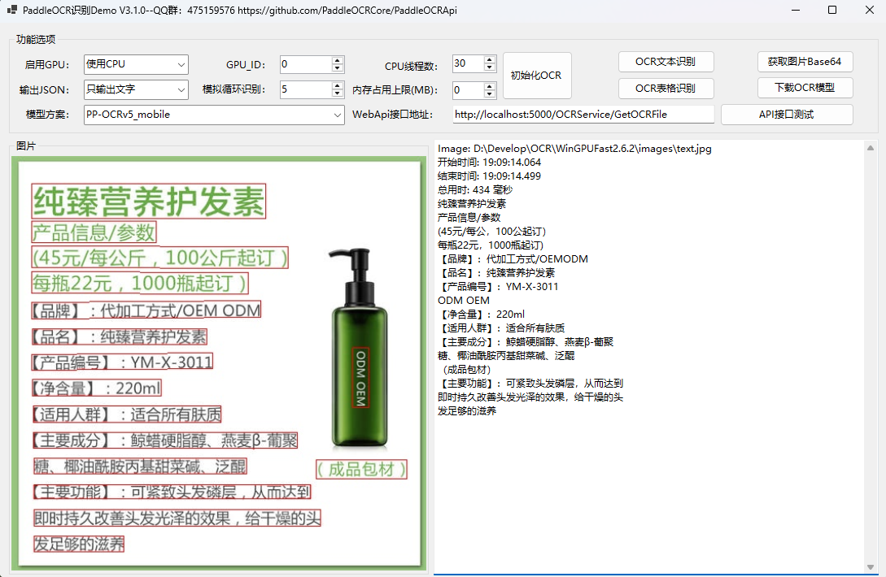

[](README.md) [](README_EN.md)
# PaddleOCRApi Offline OCR SDK - Support C#/C++/Java/Python/Go

<p align="center">
    <a href="./LICENSE"></a>
    <a href="https://github.com/PaddleOCRCore/PaddleOCRApi/releases"></a>
    <a href="https://github.com/PaddleOCRCore/PaddleOCRApi/stargazers"></a>
</p>

## 📖 Table of Contents

- [Introduction](#-introduction)
- [Features](#-features)
- [Project Structure](#-project-structure)
- [Quick Start](#-quick-start)
- [Runtime Environment](#-runtime-environment)
- [Parameter Description](#-parameter-description)
- [GPU Configuration](#-gpu-configuration)
- [Community](#-community)
- [Changelog](#-changelog)

## 🚀 Introduction

A completely offline Chinese character recognition component based on Baidu's PaddleOCR deep encapsulation, providing a simple and easy-to-use API interface that supports C#/C++/Java/Python/Go and other development languages. Completely free to use and upgrade, supports multi-threading concurrency and automatic memory management. Built on C++ dynamic library wrapper of Baidu's PaddleOCR, supports the latest paddle_inference 3.2.2 inference engine.

**If you like this project, please give us a free Star ⭐**

Supports the latest PP-OCRv5_mobile/PP-OCRv5_server models, backward compatible with V4/V3 models and custom trained models.

> 💡 **Note**: The open-source version is suitable for learning and research. For commercial projects, paid versions are recommended for better performance and technical support. For paid version details, contact developer QQ: **2380243976**

## ✨ Features

- ✅ **Multi-Language Support**: C#, C++, Java, Python, Go
- ✅ **High Performance**: CPU/GPU inference support
- ✅ **Easy Integration**: WebAPI service for online calling
- ✅ **Multi-Threading**: Concurrent processing with automatic memory management
- ✅ **Offline Operation**: No internet required, secure data processing
- ✅ **Rich Models**: Support for PP-OCRv5/v4/v3 series models
- ✅ **Comprehensive Features**: Text detection, recognition, orientation classification, table recognition
- ✅ **Image Correction**: Document image geometric transformation, correcting distortion, tilt, and perspective deformation to improve recognition accuracy

## 📁 Project Structure

```
PaddleOCRWebApi/
├── PaddleOCRSDK/                  # Core OCR SDK project
│   ├── Services/                  # OCR service implementation
│   │   ├── OCRService.cs         # OCR recognition service
│   │   └── OCRSDK.cs             # SDK core wrapper
│   ├── UVDoc/                    # Document image correction module
│   │   └── ...                   # Geometric transformation, perspective correction
│   ├── Interface/                # Interface definitions
│   ├── Models/                   # Data models
│   └── PaddleOCRSDK.csproj      # SDK project file
│
├── OCRCoreService/               # WebAPI service project
│   ├── Controllers/              # API controllers
│   │   ├── OCRServiceController.cs      # OCR endpoints
│   │   ├── UVDocServiceController.cs    # Document correction endpoints
│   │   └── HomeController.cs            # Home page
│   ├── Services/                 # Business services
│   │   └── OCREngine.cs         # OCR engine
│   ├── Authorization/            # Authorization
│   ├── Extensions/               # Extension methods
│   ├── Utilities/                # Utility classes
│   ├── Views/                    # View files
│   ├── wwwroot/                  # Static resources
│   ├── appsettings.json         # Configuration file
│   └── README.md                # WebAPI documentation
│
├── Demo/                         # Multi-language examples
│   ├── CPP/                     # C++ calling example
│   │   ├── PaddleOCRCpp.cpp    # C++ example code
│   │   └── PaddleOCR.h         # C++ header file
│   ├── Python/                  # Python calling example
│   │   ├── OCRPythonDemo.py    # Python example
│   │   └── OCRTablePythonDemo.py # Table recognition example
│   ├── GoDemo/                  # Go calling example
│   │   └── OCRGoDemo.go        # Go example code
│   ├── PaddleVisionWinForm/    # Document correction WinForms demo
│   │   ├── MainForm.cs         # Main form
│   │   └── ...                 # Document distortion correction, perspective transform demo
│   └── WinFormsApp/            # OCR recognition WinForms demo
│       ├── MainForm.cs         # Main form
│       └── Services/           # Service layer
│
├── Doc/                        # Documentation
└── README.md                   # Project documentation
```

## 🚀 Quick Start

### 1. NuGet Package Installation (Recommended)

For paddle_inference 3.2+ version:

```xml
<PackageReference Include="PaddleOCRRuntime_x64" Version="4.0.0" />
```

For paddle_inference 2.6.2 version:

```xml
<PackageReference Include="PaddleOCRSDK" Version="1.0.5" />
<PackageReference Include="PaddleOCRRuntime_x64" Version="1.0.0" />
```

### 2. WebAPI Service Startup

```bash
# Run WebAPI service
cd OCRCoreService
dotnet run --urls http://*:5000

# Access Swagger documentation
http://localhost:5000/swagger/index.html
```

For detailed WebAPI documentation, please refer to: [WebApi Documentation](./OCRCoreService/README.md)

## 🔧 Runtime Environment

### Basic Requirements

OCRCoreService (WebAPI) and WinForms project require VS2022 + .NET 8.0

### Inference Library Version

1. **Default paddle_inference 3.2.2 CPU version**, other versions can be downloaded manually or compiled

2. **paddle_inference 2.6.2 version** download Release V1.0.5
   - CPU version (included in PaddleOCRRuntime_x64):
   - https://paddle-inference-lib.bj.bcebos.com/2.6.2/cxx_c/Windows/CPU/x86-64_avx-mkl-vs2019/paddle_inference.zip

3. **Core file PaddleOCR.dll** is a C++ dynamic library, supports CPU/GPU mode (GPU requires environment setup)

### .NET Platform Support

Supported frameworks: netstandard2.0; net45; net461; net47; net48; net6.0; net7.0; net8.0; net9.0

### WinFormDemo Preview




## 📋 Parameter Description

| Parameter Name               | Default | Description                                                                                   |
| ---------------------------- | ------- | --------------------------------------------------------------------------------------------- |
| det_model_dir                | -       | Detection model inference model path                                                          |
| cls_model_dir                | -       | Direction classifier inference model path                                                     |
| rec_infer                    | -       | Text recognition model inference model path                                                   |
| keys                         | -       | Text recognition dictionary file                                                              |
| table_model_dir              | -       | Table recognition model inference model path                                                  |
| table_char_dict_path         | -       | Table recognition dictionary file                                                             |
| **General Parameters**       | --      | --                                                                                            |
| det                          | true    | Whether to execute text detection                                                             |
| rec                          | true    | Whether to execute text recognition                                                           |
| cls                          | false   | Whether to execute text direction classification                                              |
| use_gpu                      | false   | Whether to use GPU                                                                            |
| gpu_id                       | 0       | GPU id, effective when using GPU                                                              |
| gpu_mem                      | 4000    | GPU memory usage                                                                              |
| use_tensorrt                 | false   | Whether to enable TensorRT when using GPU prediction                                          |
| cpu_mem                      | 4000    | CPU memory usage limit in MB. -1 means no limit                                               |
| cpu_math_library_num_threads | 10      | Number of threads for CPU prediction, larger value means faster prediction with sufficient cores |
| enable_mkldnn                | true    | Whether to use mkldnn library, disabling reduces memory usage but decreases speed             |
| **Detection Model**          | --      | --                                                                                            |
| max_side_len                 | 960     | When input image is larger than 960, scale proportionally to make longest side 960            |
| det_db_thresh                | 0.3     | Threshold for filtering DB prediction binarized image, 0-0.3 has minimal effect               |
| det_db_box_thresh            | 0.5     | DB post-processing box filtering threshold, reduce if detection misses boxes                  |
| det_db_unclip_ratio          | 1.6     | Text box tightness, smaller value means box closer to text                                    |
| use_dilation                 | false   | Whether to use dilation on output map                                                         |
| det_db_score_mode            | true    | true: use polygon to calculate bbox score, false: use rectangle. Rectangle is faster, polygon is more accurate for curved text |
| visualize                    | false   | Whether to visualize results, saves to output folder with same name as input image            |
| **Orientation Classifier**   | --      | --                                                                                            |
| use_angle_cls                | false   | Whether to use orientation classifier                                                         |
| cls_thresh                   | 0.9     | Orientation classifier score threshold                                                        |
| cls_batch_num                | 1       | Orientation classifier batch recognition quantity                                             |
| **Recognition Model**        | --      | --                                                                                            |
| rec_batch_num                | 6       | Text recognition model batch recognition quantity                                             |
| rec_img_h                    | 48      | Text recognition model input image height                                                     |
| rec_img_w                    | 320     | Text recognition model input image width                                                      |
| **Table Recognition Model**  | --      | --                                                                                            |
| table_max_len                | 488     | Table recognition model input image long side size, final network input size is (table_max_len, table_max_len) |
| merge_empty_cell             | true    | Whether to merge empty cells                                                                  |
| table_batch_num              | 1       | table_batch_num                                                                               |

For more complete examples, please check the `Demo/` directory for each language example code.

## 🖥️ GPU Configuration

### paddle_inference 2.6.2 GPU Version

**Download Link**: [paddle_inference2.6.2](https://www.paddlepaddle.org.cn/inference/v2.6/guides/install/download_lib.html#windows)
- https://paddle-inference-lib.bj.bcebos.com/2.6.2/cxx_c/Windows/GPU/x86-64_cuda12.0_cudnn8.9.1_trt8.6.1.6_mkl_avx_vs2019/paddle_inference.zip

**Configuration Steps**:

1. Extract and copy the following DLL files to the program running folder:
   - `paddle\lib\` directory: `common.dll`, `paddle_inference.dll`
   - `third_party\install\mkldnn\lib\` directory: `mkldnn.dll`
   - `third_party\install\mklml\lib\` directory: `libiomp5md.dll`, `mklml.dll`

2. Install CUDA and CUDNN, copy the corresponding cublas64_12.dll、cublasLt64_12.dll、cudnn_cnn64_9.dll、cudnn_engines_precompiled64_9.dll、cudnn_engines_runtime_compiled64_9.dll、cudnn_graph64_9.dll、cudnn_heuristic64_9.dll、cudnn_ops64_9.dll、cudnn64_9.dll
   - Located at: `C:\Program Files\NVIDIA GPU Computing Toolkit\CUDA\v12.x\bin`

### paddle_inference 3.x GPU Version

**Configuration Steps**:

1. Extract and copy the following DLL files to the program running folder:
   - `paddle\lib\` directory: `common.dll`, `paddle_inference.dll`
   - `third_party\install\mkldnn\lib\` directory: `mkldnn.dll`
   - `third_party\install\mklml\lib\` directory: `libiomp5md.dll`, `mklml.dll`

2. Install CUDA and CUDNN, copy the corresponding cudnn64_x.dll
   - Located at: `C:\Program Files\NVIDIA GPU Computing Toolkit\CUDA\v12.x\bin\cudnn64_x.dll`

### Related Download Links

| Resource | Link |
|----------|------|
| CUDA | [https://developer.nvidia.com/cuda-toolkit-archive](https://developer.nvidia.com/cuda-toolkit-archive) |
| CUDNN | [https://developer.nvidia.cn/rdp/cudnn-archive](https://developer.nvidia.cn/rdp/cudnn-archive) |
| TensorRT | [https://developer.nvidia.com/nvidia-tensorrt-download](https://developer.nvidia.com/nvidia-tensorrt-download) |
| PP-OCRv4/v5 Models | [https://www.paddleocr.ai/latest/version3.x/pipeline_usage/OCR.html](https://www.paddleocr.ai/latest/version3.x/pipeline_usage/OCR.html) |
| Other Models | [https://gitee.com/paddlepaddle/PaddleOCR/blob/main/docs/version3.x/model_list.md) |

## 🔗 WebAPI Interface

For detailed WebAPI documentation, please refer to: [WebApi Documentation](./OCRCoreService/README.md)

**Swagger Documentation**: `http://localhost:5000/swagger/index.html`

## 💬 Community

Welcome to join QQ group **475159576** for discussion, or add QQ for custom projects: **2380243976**

If you like this project, please give us a free **Star ⭐**


## ☕ Donation

If this project helps you, please scan the QR code below to buy us a coffee.


## 🎯 Technical Architecture

### Core Components

```
┌─────────────────────────────────────────┐
│      Application Layer                  │
│  WinForms / WebAPI / Console / SDK      │
└─────────────────┬───────────────────────┘
                  │
┌─────────────────▼───────────────────────┐
│    .NET Wrapper (PaddleOCRSDK)          │
│    OCRService / IOCRService / Models    │
└─────────────────┬───────────────────────┘
                  │ P/Invoke
┌─────────────────▼───────────────────────┐
│    C++ Library (PaddleOCR.dll)          │
│  Detection / Recognition / Cls / Table  │
└─────────────────┬───────────────────────┘
                  │
┌─────────────────▼───────────────────────┐
│    Paddle Inference Engine              │
│    paddle_inference 3.2.2 / 2.6.2       │
└─────────────────┬───────────────────────┘
                  │
┌─────────────────▼───────────────────────┐
│      Hardware Acceleration              │
│     CPU (MKL) / GPU (CUDA+TensorRT)     │
└─────────────────────────────────────────┘
```

### Workflow

1. **Image Preprocessing** → Image normalization, size adjustment
2. **Text Detection** → DBNet detects text regions
3. **Orientation Classification** → Text direction correction (optional)
4. **Text Recognition** → CRNN recognizes text content
5. **Result Output** → JSON/text format return

## 📝 Changelog

For detailed update history, please see: [Changelog](./Doc/CHANGELOG_EN.md)

## 🔍 FAQ

For frequently asked questions, please see: [FAQ](./Doc/FAQ_EN.md)

## 🙏 Acknowledgments

This project is based on the following open source projects:
- [PaddleOCR](https://github.com/PaddlePaddle/PaddleOCR) - Baidu PaddleOCR toolkit
- [Paddle](https://github.com/PaddlePaddle/Paddle) - PaddlePaddle inference engine

## ⭐️ Star

[](https://star-history.com/#PaddleOCRCore/PaddleOCRApi&Date)

## 📄 License

This project is released under [Apache License Version 2.0](./LICENSE). Welcome to use and contribute.
